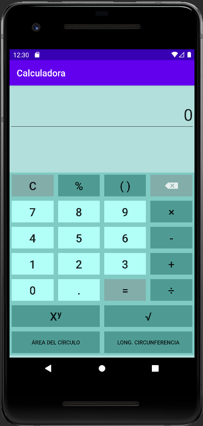

# Calculadora
Programa __Calculadora__ desarrollado en Android Studio con las siguientes funciones:
>- Suma
>- Resta
>- Multiplicación
>- División
>- Potencia
>- Raíz cuadrada
>- Cálculo del área de un círculo
>- Cálculo longitud de una circunferencia
## Sample

